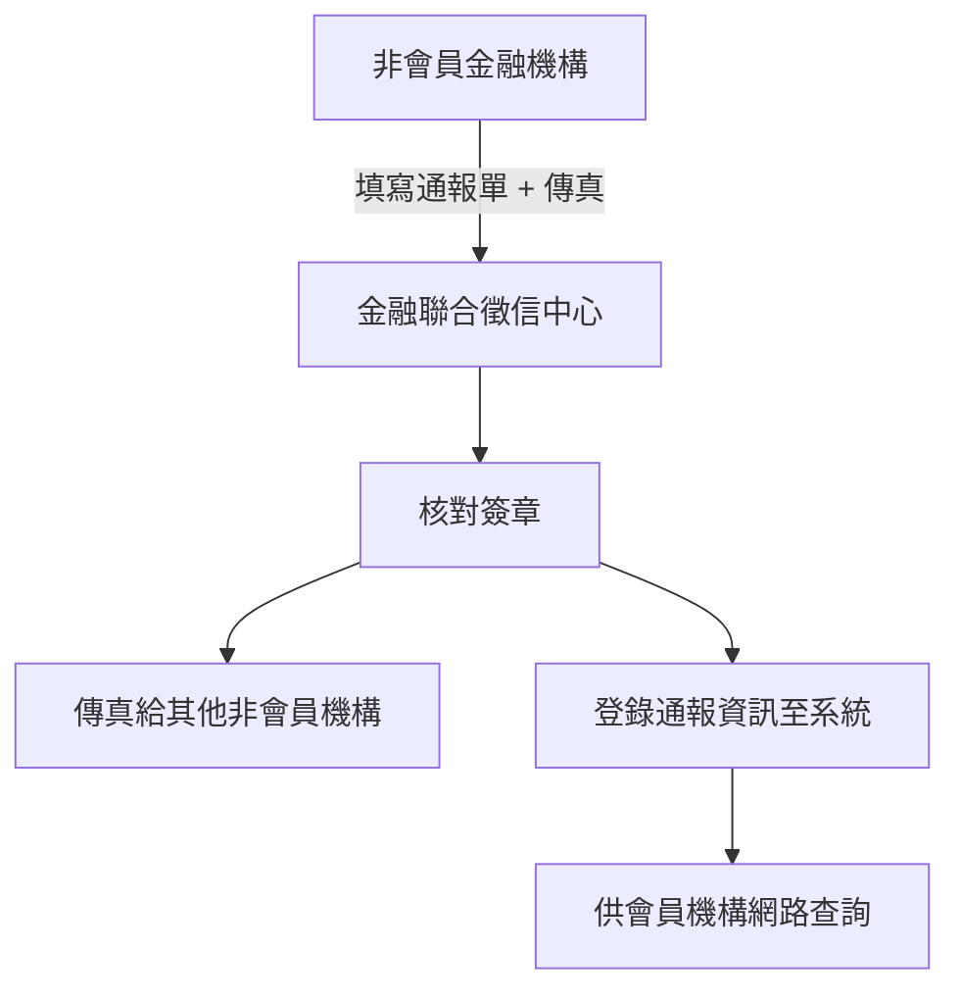

這段是在說明：**如果某家金融機構不是「金融聯合徵信中心」的會員機構，該怎麼進行詐騙案件的通報流程**。整體分為兩大步驟，主要針對「書面通報的處理程序」。

---

## ✅ 條文分段解釋 + 範例說明

---

### 🔹 前言重申

> 為發揮金融同業互助精神，共同防範歹徒詐騙案件，以維護社會信用交易，特訂立本要點。

✅ 說明這些規定是為了：
- 讓各家金融機構互相協助、防堵詐騙
- 維持社會上對金融交易的信任

---

## 🧩 條文重點一：
### **1. 金融機構要登錄聯絡窗口資訊給聯徵中心**

> 各金融機構應指定聯絡單位、聯絡人及代理人，並以書面方式通知金融聯合徵信中心，以便辦理登錄。

### ✅ 解釋：
- 每家金融機構的**總公司**要指定專人負責處理通報業務，包括：
  - 負責單位（例：法遵部、風險管理部）
  - 聯絡人與代理人（有人休假時可遞補）
  - 必須提供簽名與傳真號碼
- 要用**正式書面方式**把這些資料送交聯徵中心，讓對方知道誰可以接收/傳送通報。

📌 同時，聯徵中心也會主動提供自己的聯絡人名單與聯絡方式給各家機構。

---

### ✅ 範例：
> 郵政儲金局不是聯徵中心會員，因此它指定「郵政總局法務課」為通報窗口，負責人為王小美，代理人為李大志，附上簽名與機構傳真號碼，一併書面送交聯徵中心。 
> 聯徵中心則回傳由「資料管理組」林先生負責處理通報，附上簽名與傳真機號。

---

## 🧩 條文重點二：
### **2. 通報方式與處理流程**

> 非會員機構通報時，用專用通報單傳真至聯徵中心，中心收到後核對簽章無誤，再將案件傳真轉知其他非會員機構，同時登錄入資料庫，供會員機構查閱。

### ✅ 解釋：

流程如下：

#### 🧾 通報步驟（針對非會員機構）：
1. 使用「**專用通報單**」（格式統一）
2. **傳真** 給聯徵中心指定人員
3. 聯徵中心會：
   - **確認簽名、章戳正確**
   - 把案件 **轉傳給其他非會員機構**
   - 同時將案件 **輸入系統資料庫**，讓「會員機構」也能在線上看到這筆通報紀錄

---

### ✅ 範例：
> 台灣農業銀行不是聯徵中心會員。 
> 它發現某人持偽造金融卡提領存款，立即用「詐騙通報專用表單」填寫案件細節，並蓋章簽名後傳真給聯徵中心。 
> 聯徵中心確認無誤後，把通報單也傳真給其他非會員銀行（如合作金庫某支行），同時將簡要資訊上傳到通報系統，讓中信、永豐等會員銀行也能得知。

---

## 🔁 簡單流程整理：

---

## ✅ 小結

| 步驟 | 說明 | 範例 |
|------|------|------|
| 📌 指定聯絡人 | 每家機構要指定處理通報的人員，並送交聯徵中心 | 郵局法務課 → 聯徵中心資料管理組 |
| 🧾 通報方式 | 使用專用通報單、簽章、傳真送出 | 台灣農業銀行發現詐騙傳真通報 |
| 🔄 資料處理 | 聯徵中心核對 → 傳真其他機構 + 系統登錄 | 傳真給其他非會員行，並讓會員行可查 |

---

如果你希望，我也可以幫你把整份《通報要點》內容彙整成「重點表格 + 範例」筆記檔案，要幫你製作嗎？還是我們繼續下一條？